# Observabilidad con Microservicios Reactivos

En la última década(link) hemos visto cómo tendencias importantes entre las cuales encontramos a la Programación Reactiva, la programación
funcional, la capacidad exponencial de cómputo multi hilo y el procesamiento en la nube; están teniendo un impacto profundo
en la manera cómo se desarrollan y despliegan nuevas aplicaciones en ambientes empresariales. Como ya esta definido en
el manifiesto reactivo (link) estos sistemas proveen elasticidad(escalan vertical y horizontalmente),
resiliencia(diseñados para manejar errores sin comprometer la arquitectura), alta disponibilidad(Responden en tiempos
aceptables) y son basados en diseños enfocados a mensajes(interactúan con mensajería asíncrona). (Imagen)

## JVM en la nube y su complejidad inherente

Java (y la maquina virtual de Java) se ha consolidado como una de las plataformas preferidas en entornos empresariales,
lamentablemente como lo hemos visto con el proyecto loom() la evolución del lenguaje no ha priorizado las API enfocadas
a programación reactiva, es ahí donde Vert.x y Quarkus brillan, proveyendo no solo API’s que no bloquean el hilo en el
que se está ejecutando, sino que además brindan extensiones que facilitan la programación reactiva y funcional. El precio e
impacto que tiene esto en los equipos de desarrollo ágiles (como Scrum o Kanban) es alto debido a la complejidad
asociada al desarrollo de estos sistemas, al planeamiento de funcionalidades a brindar, y al estándar actual de despliegue
de estas aplicaciones desde DTAP hasta la nube por medio de contenedores y Kubernetes. Ahora bien si por un lado
monitoreo y observabilidad solucionan gran parte de estos challenges, crean nuevas tareas usualmente relegadas a 
desarrolladores con mayor experiencia, generando así otra oportunidad para actualizar dinámicas de
equipos de trabajo en donde parte de las responsabilidades se puedan transmitir por medio de tecnologías simples, de la
misma forma en la que arquitecturas que eran exclusivas para trabajo en el backend se transfirieron a los desarrollos de
frontend cuando los navegadores adquirieron más capacidad de procesamiento.

### Flujos Reactivos[^3]

Los flujos reactivos son una iniciativa para proporcionar un estándar para el procesamiento de flujo asíncrono con
contrapresión(*back-pressure*). Proporcionando un conjunto mínimo de interfaces y protocolos que describen las operaciones
y entidades para lograr los flujos de datos asincrónicos con contrapresión sin bloqueo. Estos flujos no definen los operadores que
los manipulan, y se utilizan principalmente como una capa de interoperabilidad. Esta iniciativa es apoyada por
Netflix, Lightbend y Red Hat(Uno de los mayores contribuidores de Vert.x y Kubernetes), entre otros.

### Programación Reactiva

La programación reactiva es un modelo de desarrollo orientado a los flujos y la propagación de los datos. En esta programación, los estímulos son los datos que transitan en el flujo, que se denominan
corrientes.{width="5.5in" height="3.585209973753281in"}

#### Programación Reactiva y Sistemas Reactivos

Si bien la programación reactiva es un modelo de desarrollo, los sistemas reactivos son un estilo arquitectónico
utilizado para construir sistemas distribuidos[^4]. Provee un conjunto de principios utilizados para lograr capacidad de
respuesta y crear sistemas que respondan a las solicitudes de manera oportuna, tolerante a fallas y/o bajo carga.

Para construir dicho sistema, los sistemas reactivos adoptan un enfoque basado en mensajes. Todos los componentes
interactúan usando mensajes enviados y recibidos de forma asíncrona. Para desacoplar remitentes y receptores, los
componentes envían mensajes a direcciones virtuales (por ejemplo una URL). Se pueden registrar varios receptores en la
misma dirección: Los remitentes no bloquean y esperan una respuesta. El remitente puede recibir una respuesta más tarde,
pero mientras tanto, puede recibir y enviar otros mensajes. El uso de interacciones asíncronas de paso de mensajes
proporciona sistemas reactivos con dos propiedades críticas:

• *Elasticidad*: la capacidad de escalar horizontalmente

• *Resiliencia*: la capacidad de tolerar fallos y recuperarse

La elasticidad proviene del desacoplamiento proporcionado por las interacciones de mensajes. Los mensajes enviados a una
dirección pueden ser consumidos por un conjunto de consumidores que utilizan una estrategia de equilibrio de carga(*
load-balancing*). Cuando un sistema reactivo se enfrenta a un pico en la carga, puede generar nuevas instancias de
consumidores y eliminarlas después.

Esta característica de resiliencia es proporcionada por la capacidad de manejar fallas sin bloqueo, así como la
capacidad de replicar componentes. Primero, las interacciones de mensajes permiten a los componentes lidiar con fallas
localmente. Gracias al aspecto asíncrono, los componentes no esperan activamente las respuestas, por lo que una falla en
un componente no afectaría a otros componentes. La replicación también es una habilidad clave para manejar la
resiliencia. Cuando un mensaje de procesamiento de nodo falla, el mensaje puede ser procesado por otro nodo registrado
en la misma dirección.

Gracias a estas dos características, el sistema se vuelve receptivo. Puede adaptarse a cargas más altas o más bajas y
continuar atendiendo solicitudes ante cargas altas o fallas. Este conjunto de principios es primordial cuando se
construyen sistemas de microservicios que están altamente distribuidos y cuando se trata de servicios que están fuera
del control de la persona que llama(de ahí la importancia de observabilidad y monitoreo). Es necesario ejecutar varias
instancias de sus servicios para equilibrar la carga y manejar fallas sin interrumpir la disponibilidad. Por medio del
uso de Vert.x implementaré estos conceptos.

### Microservicios Reactivos

Al construir un sistema compuesto de microservicios (y por lo tanto distribuido), cada servicio puede cambiar,
evolucionar, fallar, exhibir lentitud o ser retirado en cualquier momento. Tales problemas no deben afectar el
comportamiento de todo el sistema. El sistema debe aceptar los cambios y ser capaz de manejar fallas. Podrá ejecutar en
un modo degradado, pero aun así el sistema deberá ser capaz de manejar las solicitudes.

Para garantizar dicho comportamiento, los sistemas de microservicio reactivos son microservicios comprimidos o
reactivos. Estos microservicios tienen cuatro características:

Asincronismo

Autonomía

Resiliencia

Elasticidad

Los microservicios reactivos son autónomos. Se pueden adaptar a la disponibilidad o indisponibilidad de los servicios
que los rodean. Sin embargo, la autonomía se combina con el aislamiento. Los microservicios reactivos pueden manejar
fallas localmente, actuar de manera independiente y cooperar con otros según sea necesario. Un microservicio reactivo
utiliza el paso de mensajes asíncrono para interactuar con sus pares. También recibe mensajes y tiene la capacidad de
producir respuestas a estos mensajes.

Gracias al flujo de mensajes asíncrono, los microservicios reactivos pueden enfrentar fallas y adaptar su comportamiento
consecuentemente. Las fallas no deben propagarse, sino manejarse cerca del componente causante de la falla. Es aquí
donde *Observabilidad* y *Monitoreo* juegan un rol a la hora de identificar estos fallos, tanto en diferentes faces del
desarrollo así como en la puesta en marcha a producción y posterior mantenimiento de estos microservicios. Cuando falla
un microservicio, el microservicio del consumidor debe manejar la falla y no propagarla. Este principio de aislamiento
es una característica clave para evitar que las fallas surjan y *rompan* el sistema. La resiliencia no se trata solo de
manejar el fracaso, también se trata de la auto-recuperación. Un microservicio reactivo debe implementar estrategias de
recuperación o compensación cuando ocurren fallas.

Finalmente, un microservicio reactivo debe ser elástico, de modo que el sistema pueda adaptarse a la cantidad de
instancias para administrar la carga. Esto implica un conjunto de restricciones como por ejemplo; evitar el estado en
memoria, compartir el estado entre instancias si es necesario, o poder enrutar mensajes a las mismas instancias para
servicios con estado.

### Modelo de desarrollo Asíncrono

Los patrones de diseño *RESTful*[^5] son comunes en el mundo de los microservicios. Lo más probable es que se
implementen de forma síncrona y por lo tanto, de bloqueo. Incluso si esto se puede cambiar en Java EE, y las
implementaciones admiten llamadas asincrónicas, aún podrían considerarse como ciudadano de segunda clase en una
implementación típica.{width="5.5in" height="3.7291666666666665in"}

El *middleware* orientado a mensajes (MOM[^6]) es una solución más razonable para los problemas de integración y
mensajería en este campo, especialmente cuando se trata de microservicios expuestos por sistemas host y conectados a
través de MOM. Se puede usar una combinación de solicitud/respuesta en REST y publicación/suscripción de mensajes para
satisfacer las necesidades de negocio.

#### Observabilidad y Frameworks asíncronos en la JVM

A la hora de aplicar observabilidad con Jaeger cuando trabajamos con librerías y frameworks en la máquina virtual de
java(jvm) hemos de ser precavidos y algunas veces desaprender y reevaluar "Las mejores practicas", por ejemplo:
Instrumentando el async-http-client hemos de encontrar que si combinamos este poderoso framework con APIs nativas como
NEO, o usando autocloseable //TODO ejemplo simple combinado con

### Quarkus

Quarkus es un fullstack framework de trabajo Java nativo de Kubernetes creado para máquinas virtuales Java (JVM) y
compilación nativa, que optimiza Java específicamente para contenedores y le permite convertirse en una plataforma
eficaz para entornos sin servidor, en la nube y Kubernetes.

Quarkus está diseñado para funcionar con estándares, marcos y bibliotecas populares de Java como Eclipse MicroProfile y
Vert.x, así como con Apache Kafka, RESTEasy (JAX-RS), Hibernate ORM (JPA), Spring, Infinispan, Camel y muchos más.

La solución de inyección de dependencias de Quarkus se basa en CDI (inyección de contextos y dependencias) e incluye un
marco de extensión para ampliar la funcionalidad y configurar, arrancar e integrar un marco en su aplicación. Agregar
una extensión es tan fácil como agregar una dependencia, o puede usar las herramientas de Quarkus.

También proporciona la información correcta a GraalVM (una máquina virtual universal para ejecutar aplicaciones escritas
en varios lenguajes, incluidos Java y JavaScript) para la compilación nativa de su aplicación.

#### Instrumentación en Quarkus

Al aplicar instrumentación en Quarkus (usaremos la aplicación instrumentada de los manuales de Quarkus y la extenderemos
para ilustrar conceptos https://quarkus.io/guides/opentracing) veremos que a diferencia de con Vert.x tendemos menos
control con configuraciones customizadas, pero muchas de las cosas requeridas para la mayoría de proyectos estarán
listas (out-of-the-box) si no podemos hacer uso de los scopes:

```java
import javax.enterprise.context.ApplicationScoped;

import org.eclipse.microprofile.opentracing.Traced;

@Traced
@ApplicationScoped
public class FrancophoneService {

    public String bonjour() {
        return "bonjour";
    }
}

```

#### Quarkus y eclipse microProfile openTracing

Básicamente microProfile es una especificación de código abierto que aporta una serie de características centradas en
microservicios al ecosistema de Java EE.
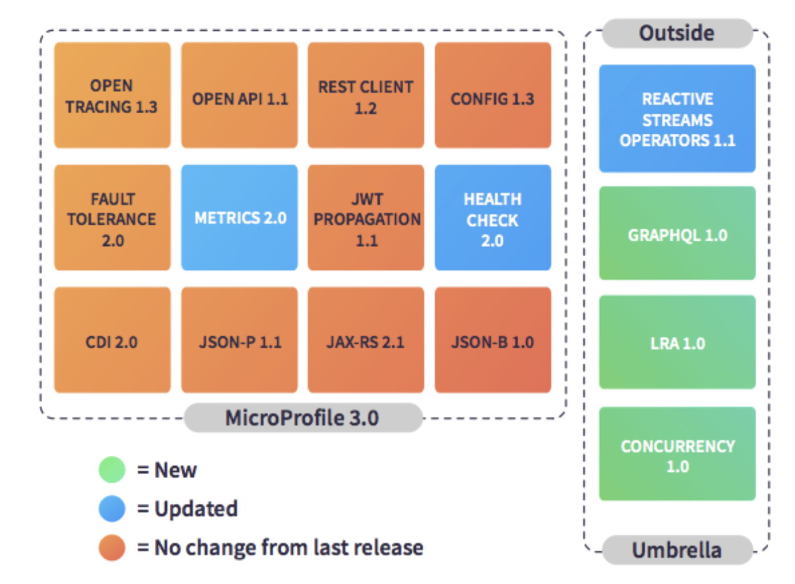
Ahora bien, a la hora de necesitar instrumentar la data proveniente de la logica de negocios de la aplicación, vamos a
tener que hacer uso del tracer configurado como esta descrito en la wiki
de [Eclipse MicroProfile OpenTracing](https://github.com/eclipse/microprofile-opentracing/blob/master/spec/src/main/asciidoc/microprofile-opentracing.asciidoc)
el cual podemos acceder usando inyección CDI ```io.opentracing.Tracer```.Con él podemos fácilmente generar tags o hacer
uso de los logs o usar el baggage de nuestro Span:

```java

@Traced
@ApplicationScoped
public class NapService {

    @Inject
    io.opentracing.Tracer configuredTracer;

    public String nap() {
        configuredTracer.activeSpan().log("Received request on Thread: " + Thread.currentThread().getName());
        final BigDecimal bigDecimal = Pi.computePi(20000);
        configuredTracer.activeSpan().setTag("out.computed.pi", bigDecimal);
        configuredTracer.activeSpan().log("Doing some load");
        configuredTracer.activeSpan().log("Back from the nap: " + Thread.currentThread().getName());
        return "Nap from " + new Date().toString();
    }

}

```

https://github.com/acroquest/micrometer-kibana-dashboard/

### Vert.x

La esencia de Eclipse Vert.x es procesar eventos asincrónicos, principalmente provenientes de E / S sin bloqueo, y el
modelo de subprocesos es procesar eventos en un *bucle de eventos*.

Vert.x es un kit de herramientas y no un marco: no proporciona una base predefinida para su aplicación, por lo que puede
usar Vert.x como una biblioteca dentro de una base de código más grande. Vert.x no tiene muchas opiniones sobre las
herramientas de compilación que debe utilizar, cómo desea estructurar su código, cómo piensa empaquetarlo y desplegarlo,
etc. Una aplicación Vert.x es un conjunto de módulos que proporciona exactamente lo que necesita , y nada más. Si no
necesita acceder a una base de datos, su proyecto no necesita depender de las API relacionadas con la base de datos.

Vert.x está estructurado de la siguiente manera:

*Vertx-core*, proporciona la programación síncrona de API, E / S sin bloqueo, transmisión y acceso conveniente a
protocolos en red como TCP, UDP, DNS, HTTP o WebSockets,

*Vert.x stack(modulos proporcionados por la comunidad),* como una mejor API web (vertx-web) o bases de datos (
vertx-redis, vertx-mongo, etc.),

*Extensiones*: un amplio sistema de proyectos que brindan incluso más funcionalidades, como

conectando con Apache Cassandra, E / S sin bloqueo para comunicarse entre procesos del sistema, etc.

Vert.x es políglota, ya que admite la mayoría de los lenguajes JVM populares y relacionados: JavaScript, Ruby, Kotlin,
Scala, Groovy y más. Curiosamente, el soporte de estos lenguajes no es solo a través de la interoperabilidad de estos
lenguajes con Java. Se están generando enlaces idiomáticos, para que pueda escribir código Vert.x en estos idiomas que
aún se siente natural. Por ejemplo, los enlaces Scala usan las futuras API de Scala[^14]. Y, por supuesto, puede mezclar
y combinar diferentes lenguajes compatibles dentro de la misma aplicación Vert.x.

#### Reactor (Patrón de diseño) y el Bucle de eventos

Desde la wikipedia[^15] vemos que: "El patrón de diseño reactor es un patrón de programación concurrente para manejar
los pedidos de servicio entregados de forma concurrente a un manejador de servicio desde una o más entradas. El
manejador de servicio demultiplexa los pedidos entrantes y los entrega de forma sincrónica a los manejadores de pedidos
asociados."

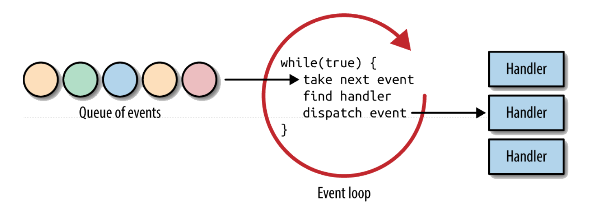{width="5.5in" height="2.6139807524059493in"}

Ahora bien, Eclipse Vert.x implementa un patrón multi-reactor soportado por eventloops. En el Reactor, existe un flujo
de eventos delegados a los manejadores por un hilo llamado eventloop(bucle de eventos). Debido a que el bucle de eventos
observa el flujo de eventos y llama a los controladores(handlers) para manejar el evento, es importante que NUNCA
bloquee el bucle de eventos. Si los controladores no están disponibles para el bucle de eventos, entonces el bucle de
eventos tiene que esperar; por lo tanto, efectivamente llamamos al evento loop bloqueado.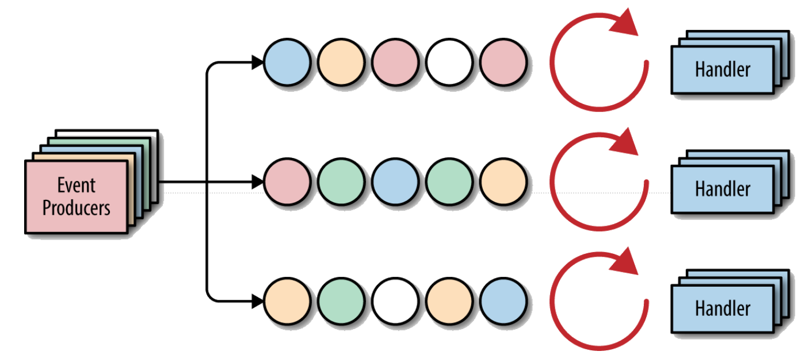
{width="5.5in" height="3.0584405074365706in"}

Eclipse Vert.x implementa un patrón multi-reactor donde, por defecto, cada núcleo de CPU tiene dos bucles de eventos.
Esto le da a las aplicaciones que usan Vert.x la capacidad de respuesta necesaria cuando aumenta el número de eventos.

Otro concepto importante es el bus de eventos, que es cómo las vértices(*verticles*: unidades mínimas de procesamiento
de Vert.x) pueden comunicarse entre sí de una manera de publicación-suscripción. Los vértices se registran en el bus de
eventos y se les da una dirección para escuchar. El bus de eventos permite escalar los vértices, ya que solo necesitamos
especificar en qué dirección un vértice escucha los eventos y dónde debe publicar esos eventos.

## Opentracing, OpenTelemetry & Jaeger[^11]

Mientras que OpenTelemetry agrupa una serie de herramientas y APIs enfocadas a generar, colectar y exportar data
telemétrica(metricas, logs y trazas) de software nativo de la nube, Opentracing Es una API independiente del proveedor a
utilizar, para ayudar a los desarrolladores a instrumentar fácilmente el rastreo en su base de código. Está abierto
porque ninguna empresa lo posee. De hecho, muchas compañías de herramientas de rastreo están apoyando OpenTracing como
una forma estandarizada de instrumentar el rastreo distribuido, parte de los core asociado a Jaeger usa esta API.

Entre sus principales componentes de OpenTracing tenemos a:

*Tracer - Trazador*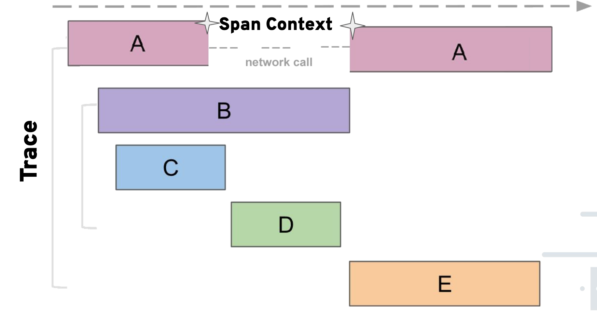{width="5.5in" height="4.147737314085739in"}

El rastreador(*tracer*) es el punto de entrada a la API de rastreo. Nos da la capacidad de crear tramos. También nos
permite extraer información de rastreo de fuentes externas e inyectar información a destinos externos.

*Span - Lapso*

Esto representa una unidad de trabajo en la traza. Por ejemplo, una solicitud web que inicia un nuevo rastreo se
denomina Span raíz. Si llama a otro servicio web, esa solicitud HTTP se incluiría en un nuevo Span secundario. Los
tramos llevan consigo un conjunto de etiquetas de información pertinentes a la solicitud que se está llevando a cabo.
También puede registrar eventos dentro del contexto de un Span. Pueden admitir flujos de trabajo más complejos que las
solicitudes web, como la mensajería asincrónica. Tienen marcas de tiempo adjuntas para que podamos construir fácilmente
una línea de tiempo de eventos para el seguimiento.

*SpanContext*

El SpanContext es la forma serializable de un Span. Permite que la información de Span se transfiera fácilmente a otros
sistemas a través del cable.

#### Jaeger

Jaeger fue originalmente desarrollado por Uber para suplir eficientemente monitoreo a su compleja arquitectura de
microservicios. A pesar de que ElasticSearch tiene una herramienta similar llamada APM[^10], Jaeger es de código abierto
y está estrictamente ligada con los estándares dictados por la CNCF. Jaeger se utiliza para monitorear y solucionar
problemas de entornos complejos de microservicios usando rastreo distribuido.

El rastreo distribuido es una forma de ver y comprender toda la cadena de eventos en una interacción compleja entre
microservicios.

Una sola llamada en una aplicación puede invocar docenas de servicios diferentes que interactúan entre sí. ¿Cómo pueden
los desarrolladores e ingenieros aislar un problema cuando algo sale mal o una solicitud se ejecuta lentamente?
Necesitamos una manera de hacer un seguimiento de todas las conexiones.

Ahí es donde entra el rastreo distribuido. A menudo se ejecuta como parte de una malla de servicios, que es una forma de
administrar y observar microservicios.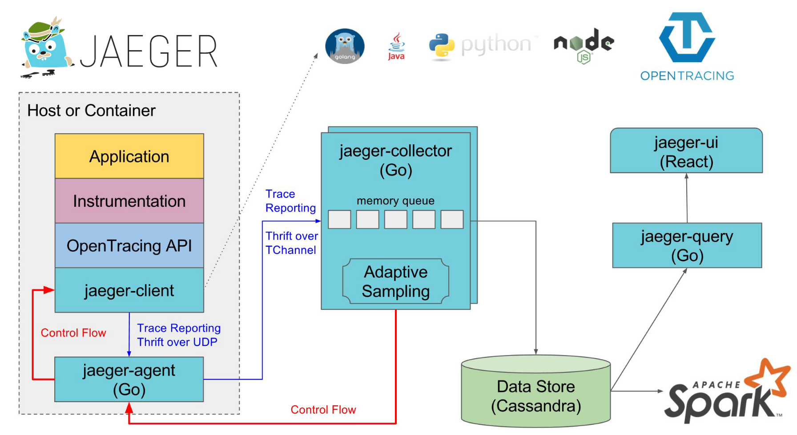{width="5.5in" height="3.7677952755905513in"}

Jaeger utiliza el rastreo distribuido para seguir la ruta de una solicitud a través de diferentes microservicios. En
lugar de adivinar, podemos ver una representación visual de los flujos de llamadas.

La información organizada sobre las transacciones es útil para la depuración y la optimización. Jaeger incluye
herramientas para monitorear transacciones distribuidas, optimizar el rendimiento y la latencia, y realizar análisis de
causa raíz (RCA), un método de resolución de problemas.

##### Terminología y componentes de Jaeger:

Jaeger presenta solicitudes de ejecución como *trazas*. Una traza muestra la ruta de datos / ejecución a través de un
sistema.

Una traza se compone de uno o más tramos. Un *lapso* es una unidad lógica de trabajo en Jaeger. Cada intervalo incluye
el nombre de la operación, la hora de inicio y la duración. Los tramos pueden estar anidados y ordenados.

Jaeger incluye varios componentes que trabajan juntos para recopilar, almacenar y visualizar tramos y trazas.

*Jaeger Client* incluye implementaciones específicas del idioma de la API OpenTracing para el rastreo distribuido. Estos
se pueden usar manualmente o con una variedad de marcos de código abierto.

*Jaeger Agent* es un demonio de red que escucha los tramos enviados a través del Protocolo de datagramas de usuario. El
agente debe colocarse en el mismo host que la aplicación instrumentada. Esto generalmente se implementa a través de un
sidecar en entornos de contenedor como Kubernetes.

*Jaeger Collector* recibe tramos y los coloca en una cola para su procesamiento.

Los *Collectors* requieren un backend de almacenamiento persistente, por lo que Jaeger también tiene un mecanismo
enchufable para el almacenamiento span.

*Query* es un servicio que recupera rastros del almacenamiento.

*Jaeger Console* es una interfaz de usuario que le permite visualizar sus datos de rastreo distribuidos.

## Plataforma de observabilidad

* Desplegar el contendor de Elasticsearch

```shell
docker run --rm -it --name=elasticsearch -e "ES_JAVA_OPTS=-Xms2g -Xmx2g" -p 9200:9200 -p 9300:9300 -e "discovery.type=single-node" -e "xpack.security.enabled=false" docker.elastic.co/elasticsearch/elasticsearch:7.10.2
```

* Desplegar el contendor de Kibana

```shell
docker run --rm -it --link=elasticsearch --name=kibana -p 5601:5601 docker.elastic.co/kibana/kibana:7.10.2
```

* Desplegar el contendor de Jaeger

```shell
docker run --rm -it --link=elasticsearch --name=jaeger -e SPAN_STORAGE_TYPE=elasticsearch -e ES_SERVER_URLS=http://elasticsearch:9200 -e ES_TAGS_AS_FIELDS_ALL=true -p 5775:5775/udp -p 6831:6831/udp -p 6832:6832/udp -p 5778:5778 -p 16686:16686 -p 14268:14268 jaegertracing/all-in-one:1.21
```

* Modificar el mapeo de los campos numéricos en Jaeger

Actualmente los campos indexados en Elasticsearch provenientes desde Jaeger son indexados como keywords, eso está bien
cuando se requieren realizar simples dashboards en kibana, pero para efectuar visualizaciones más potentes y realizar
cálculos en los mismos, hemos de requerir esos campos como numéricos, ese mapeo lo podemos efectuar de la siguiente
forma modificando el mapeo sobre el índice de Jaeger, hemos de ser precavidos con el orden de esta template y el orden
que se carga el mapeo de Jaeger

```Shell
curl --header "Content-Type: application/json" \
  --request POST \
  --data '{
  "order": 90,
  "index_patterns": [
    "*jaeger-span-*"
  ],
  "mappings": {
    "_doc": {
      "dynamic_templates": [
        {
          "span_long_no_index": {
            "match_mapping_type": "long",
            "mapping": {
              "type": "long",
              "index": false
            }
          }
        },
        {
          "span_double_no_index": {
            "match_mapping_type": "double",
            "mapping": {
              "type": "float",
              "index": false
            }
          }
        }
      ]
    }
  }
}' \
  http://localhost:9200/_template/custom-jaeger-span?include_type_name
```

obteniendo:

```shell
{"acknowledged":true}
```

* Verificar la instrumentación con la aplicación ejemplo de Jaeger

```shell
docker run --rm --link jaeger --env JAEGER_AGENT_HOST=jaeger --env JAEGER_AGENT_PORT=6831 -p9080-9083:8080-8083 jaegertracing/example-hotrod:1.21
```

Ahora bien, vamos a acceder a la [aplicación ejemplo](http://127.0.0.1:9080/) de jaeger(micro-servicios ya
instrumentados) y ejecutar algunos request para activar la persistencia de estas trazas en elasticseach

* Verificar los índices en ElasticSearch

```shell
curl -X GET "localhost:9200/_cat/indices?v"
```

Obteniendo algo similar a:

```shell
health status index                           uuid                   pri rep docs.count docs.deleted store.size pri.store.size
green  open   .apm-custom-link                gmBAV5X6SZ65c7MUwamVWQ   1   0          0            0       208b           208b
green  open   .kibana_task_manager_1          e7aZ2583RPGOUnLqcHZGzw   1   0          5           21     28.8kb         28.8kb
green  open   .apm-agent-configuration        mRd5qGOeRYysoe2itpY0xA   1   0          0            0       208b           208b
yellow open   jaeger-service-2021-02-21       b5WaBzfnTPiyeiH2KYGHmg   5   1         13           24     32.3kb         32.3kb
green  open   .kibana_1                       VFmSuTL3RY6Xcjwddom5TQ   1   0          8            0      2.1mb          2.1mb
green  open   .kibana-event-log-7.10.2-000001 csraWriSQBK-8Zm-LGaBCg   1   0          1            0      5.5kb          5.5kb
yellow open   jaeger-span-2021-02-21          _Ko7zWIWRdGdoEnEm_zDNA   5   1       1795            0      391kb          391kb
```

EL interes serán los índices de jaeger con prefijo jaeger-span-*

* Verificar el mapeo en jaeger

```shell
curl -X GET "localhost:9200/jaeger-span-*/_mapping" | jq
```

* Verificar el mapeo de algún campo de tipo entero

```shell
curl -X GET "localhost:9200/jaeger-span-*/_mapping/field/tag.http@status_code" | jq
```

Obteniendo:

```shell
{
  "jaeger-span-2021-02-21": {
    "mappings": {
      "tag.http@status_code": {
        "full_name": "tag.http@status_code",
        "mapping": {
          "http@status_code": {
            "type": "long",
            "index": false
          }
        }
      }
    }
  }
}

```

* Iniciar la aplicación de quarkus ya instrumentada (desde la raiz de este proyecto ``` cd ./quarkus ```

```shell
./mvnw compile quarkus:dev

```

- Si en lugar de por configuración quisiéremos que la aplicación se comunique con Jaeger via variables de entorno,
  usaríamos

```shell
./mvnw compile quarkus:dev -Djvm.args="-DJAEGER_SERVICE_NAME=desdequarkus -DJAEGER_AGENT_PORT=6831 -DJAEGER_SAMPLER_TYPE=const -DJAEGER_SAMPLER_PARAM=1"
```

* Comprobemos el API

```shell
curl http://localhost:8080/hello
```

Obteniendo en el shell del client

```shell
hello
```

Obteniendo en la terminal de servicio

```shell
Listening for transport dt_socket at address: 5005
__  ____  __  _____   ___  __ ____  ______ 
 --/ __ \/ / / / _ | / _ \/ //_/ / / / __/ 
 -/ /_/ / /_/ / __ |/ , _/ ,< / /_/ /\ \   
--\___\_\____/_/ |_/_/|_/_/|_|\____/___/   
19:55:56 INFO  traceId=, spanId=, sampled= [io.quarkus] (Quarkus Main Thread) opentracing-quickstart 1.0.0-SNAPSHOT on JVM (powered by Quarkus 1.11.1.Final) started in 9.884s. Listening on: http://localhost:8080
19:55:56 INFO  traceId=, spanId=, sampled= [io.quarkus] (Quarkus Main Thread) Profile dev activated. Live Coding activated.
19:55:56 INFO  traceId=, spanId=, sampled= [io.quarkus] (Quarkus Main Thread) Installed features: [cdi, jaeger, rest-client, resteasy, smallrye-opentracing]
19:56:14 INFO  traceId=e49b74075a5738ea, spanId=e49b74075a5738ea, sampled=true [or.ac.op.TracedResource] (executor-thread-1) hello
```

* Comprobemos la traza en Jaeger

Accediendo al [UI de Jaeger](http://localhost:16686/) tendremos que seleccionar el nombre del servicio de nuestra
aplicación de quarkus "desdequarkus"


Al seleccionarlo nos dara los detalles registrados de la traza de ese request

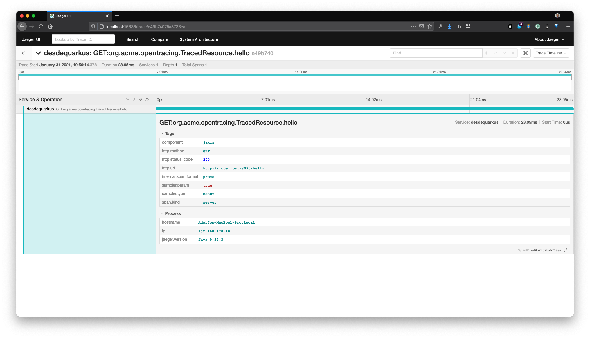

* Comprobemos la persistencia de la traza en Kibana

Importante! Vamos a requerir el patron indice (Index pattern) en kibana para que este sepa como tratar el índice por
defecto de la data que viene de Jaeger "jaeger-span-*"

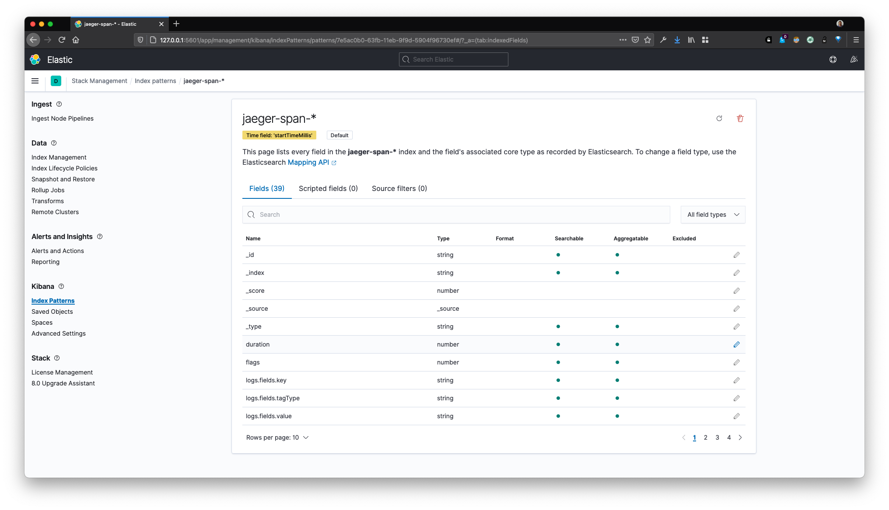

Ahora bien, creemos el pegamento entre kibana y jaeger para navegar entre el detalle de las trazas y la plataforma de
visualización, con el índice ya creado, vamos a extender el campo ```traceID``` de tal forma que se comporte como URL,
permitiéndonos ver el detalle de la traza desde kibana mismo, solamente para esto requeriremos esta URL
template ```http://localhost:16686/trace/{{value}}``` (Obviamente esta se va a tener que ajustar al ambiente en el que
estemos trabajando)

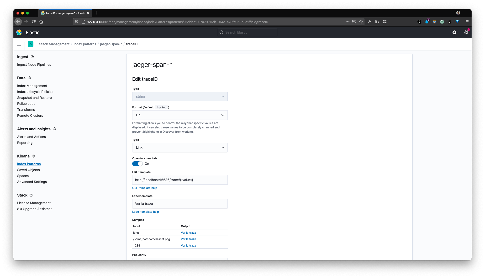

Teniendo esto podremos corroborar la data persistida de las trazas de nuestro servicio "desdequarkus" con un simple
query, desde la opción Discovery de kibana:

```
process.serviceName : "desdequarkus" 
```

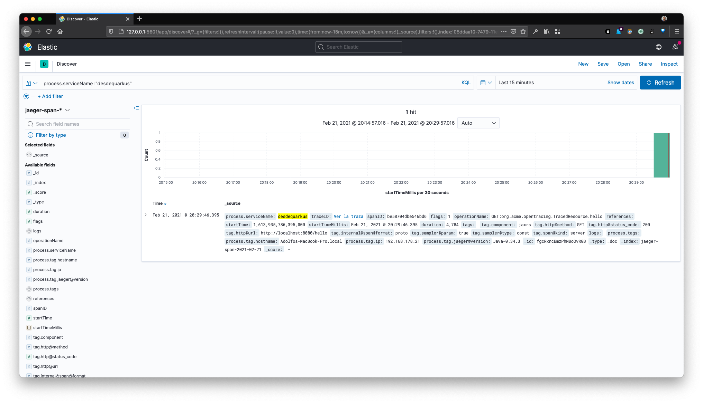
Ahora nuestras trazas persistidas no solamente seran habilitadas para su búsqueda, sino que también podremos navegar
fácilmente al detalle de esta traza en el contexto de Jaeger. Luego cuando desarrollemos las visualizaciones veremos la
utilidad de esta funcionalidad.

## Herramientas y estándares

### CNCF

Como indicado en su sitio web[^7], La Cloud Native Computing Foundation (CNCF) aloja componentes críticos de la
infraestructura tecnológica global cuando se trabaja con tecnologías alojadas en la nube. CNCF reúne a los principales
desarrolladores, usuarios finales y proveedores del mundo y ejecuta las conferencias de desarrolladores de código
abierto más grandes. CNCF es parte de la Fundación Linux sin fines de lucro.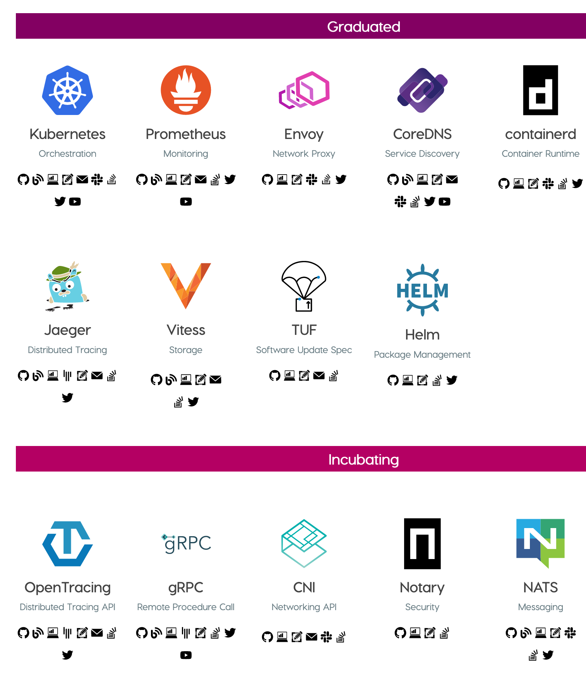{width="5.5in"
height="4.313889982502187in"}

### Containers (Docker)

Docker es una herramienta diseñada para facilitar la creación, implementación y ejecución de aplicaciones mediante el
uso de contenedores. Los contenedores permiten a un desarrollador empaquetar una aplicación con todas las partes que
necesita, como bibliotecas y otras dependencias, y desplegarla como un paquete. Al hacerlo, gracias al contenedor, el
desarrollador puede estar seguro de que la aplicación se ejecutará en cualquier otra máquina Linux, independientemente
de cualquier configuración personalizada que pueda tener la máquina que podría diferir de la máquina utilizada para
escribir y probar el código.

Acá es importante hacer una aclaración: Docker es también una compañía detrás de la tecnología que aloja probablemente
el monopolio de containers en este momento, se tiende a asociarse automáticamente a Docker con containers, pero otros
productos como *Podman*[^8] (desarrollada por *RedHat*) proveen mayor seguridad y mejor protección de los estándares
propuestos por la Open Container Initiative (OCI)[^9], mi propuesta de observabilidad y monitoreo pretende ser
independiente de la implementación de containers usada.

En cierto modo, Docker es un poco como una máquina virtual. Pero a diferencia de una máquina virtual, en lugar de crear
un sistema operativo virtual completo, Docker permite que las aplicaciones usen el mismo kernel de Linux que el sistema
en el que se ejecutan y solo requiere que las aplicaciones se envíen con cosas que aún no se ejecutan en la computadora
host. Esto proporciona un aumento significativo del rendimiento y reduce el tamaño de la aplicación.

Y lo más importante, Docker es de código abierto. Esto significa que cualquiera puede contribuir a Docker y extenderlo
para satisfacer sus propias necesidades si necesitan funciones adicionales que no están disponibles de fábrica.

### Hypertrace

Hypertrace fue desarrollado originalmente por Traceable como una plataforma de rastreo distribuida altamente escalable.
La plataforma de seguridad de aplicaciones nativas de la nube de Traceable se basa en muchos de los mismos componentes
que se utilizan en Hypertrace. Hypertrace es una plataforma de Observabilidad basada en rastreo distribuido nativa de la
nube que brinda visibilidad de sus sistemas distribuidos de desarrollo y producción. Básicamente, provee las
herramientas de visualization y persistencia de datos de la observabilidad que proponemos con esta plataforma de
observabilidad, pero considero que al momento de escribir este ensayo, no posee la flexibilidad necesaria para adecuar
las visualizaciones basadas en las soluciones customizadas del negocio especificas de las aplicaciones.

### ElasticSearch[^12]

Para centralización del monitoreo y observabilidad usare Elasticsearch, Elasticsearch es un motor de búsqueda y análisis
de código abierto distribuido para todo tipo de datos, incluidos los textuales, numéricos, geoespaciales, estructurados
y no estructurados. Elasticsearch se basa en Apache Lucene y fue lanzado por primera vez en 2010 por Elasticsearch
N.V. (ahora conocido como Elastic). Conocido por sus API REST simples, naturaleza distribuida, velocidad y
escalabilidad, Elasticsearch es el componente central de Elastic Stack, un conjunto de herramientas de código abierto
para la ingestión, enriquecimiento, almacenamiento, análisis y visualización de datos. Conocido comúnmente como ELK
Stack (después de Elasticsearch, Logstash y Kibana), Elastic Stack ahora incluye una rica colección de agentes de envío
livianos conocidos como Beats para enviar datos a Elasticsearch.

#### MetricBeat*

También parte de ElasticSearch, Metricbeat es un cargador ligero que se puede instalar en los servidores para recopilar
periódicamente métricas del sistema operativo y de los servicios que se ejecutan en el servidor, en este caso,
containers. Metricbeat toma las métricas y estadísticas que recopila y las envía a la salida que especifique, como
Elasticsearch o Logstash.

#### Kibana*

También parte de ElasticSearch, Kibana es una aplicación frontend de código abierto que se encuentra en la parte
superior del Elastic Stack, proporcionando capacidades de búsqueda y visualización de datos para datos indexados en
Elasticsearch. Conocida comúnmente como la herramienta de gráficos para Elastic Stack. La idea es usar Kibana para:

Buscar, ver y visualizar datos indexados en Elasticsearch y analizar los datos mediante la creación de gráficos de
barras, gráficos circulares, tablas, histogramas y mapas.

Combinando estos elementos visuales para luego ser compartidos a través del navegador para proporcionar vistas
analíticas en tiempo real en grandes volúmenes de datos en apoyo de casos de uso como:

> Logging y log analytics.
>
> Métrica de infraestructura y monitoreo de contenedores.
>
> Supervisión del rendimiento de la aplicación (APM).
>
> Análisis y visualización de datos geoespaciales.
>
> Análisis de seguridad.
>
> Análisis de negocio.

### Kubernetes

Kubernetes (también conocido como k8s o \"kube\") es una plataforma de orquestación de contenedores de código abierto
que automatiza muchos de los procesos manuales involucrados en la implementación, administración y escalado de
aplicaciones en contenedores.

En otras palabras, puede agrupar grupos de hosts que ejecutan contenedores de Linux, y Kubernetes le ayuda a administrar
esos clústeres de manera fácil y eficiente.

Los clústeres de Kubernetes pueden abarcar hosts en nubes locales, públicas, privadas o híbridas. Por esta razón,
Kubernetes es una plataforma ideal para alojar aplicaciones nativas de la nube que requieren un escalado rápido, como la
transmisión de datos en tiempo real a través de Apache Kafka.

Kubernetes fue originalmente desarrollado y diseñado por ingenieros de Google. Google genera más de 2 mil millones de
implementaciones de contenedores a la semana, todo impulsado por su plataforma interna, Borg. Borg fue el predecesor de
Kubernetes, y las lecciones aprendidas del desarrollo de Borg a lo largo de los años se convirtieron en la principal
influencia detrás de gran parte de la tecnología de Kubernetes.

Con Kubernetes se puede:

> Orquestar contenedores en varios hosts.
>
> Aprovechar mejor el hardware para maximizar los recursos necesarios para ejecutar sus aplicaciones empresariales.
>
> Controlar y automatizar las implementaciones y actualizaciones de aplicaciones.
>
> Montar y agregar almacenamiento para ejecutar aplicaciones con estado.
>
> Escalar aplicaciones en contenedores y sus recursos sobre la marcha.
>
> Gestionar declarativamente los servicios, lo que garantiza que las aplicaciones implementadas siempre se ejecutan de la manera deseada.
>
> Verificar el estado y autorecuperacion las aplicaciones con colocación automática, inicio automático, autorreplicación y escalado automático.

### Redhat Openshift

De acuerdo con la Wikipedia[^13]; "OpenShift, formalmente llamado Openshift Container Platform (OCP), es un producto de
computación en la nube de plataforma como servicio de Red Hat. Los desarrolladores pueden usar Git para desplegar sus
aplicaciones Web en los diferentes lenguajes de la plataforma.", pero toda su extensa funcionalidad la podríamos resumir
en Openshift es la versión empresarial de Kubernetes hecha por RedHat, Inc.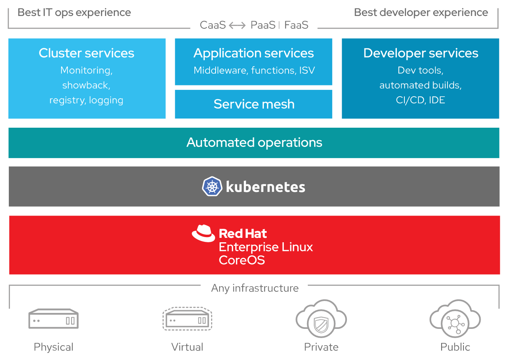{width="5.5in"
height="4.097222222222222in"}

### Kanban y Scrum

Agile es un enfoque estructurado e iterativo para la gestión de proyectos y el desarrollo de productos. Reconoce la
volatilidad del desarrollo de productos y proporciona una metodología para que los equipos auto-organizados respondan al
cambio sin salirse de los rieles. Hoy, ágil no es una ventaja competitiva. Nadie tiene el lujo de desarrollar un
producto durante años o incluso meses en una caja negra.

*Kanban* se trata de visualizar su trabajo, limitar el trabajo en progreso y maximizar la eficiencia (o flujo). Los
equipos Kanban se centran en reducir el tiempo que lleva llevar un proyecto (o historia de usuario) de principio a fin.
Para ello, utilizan un tablero kanban y mejoran continuamente su flujo de trabajo.

Los equipos de *Scrum* se comprometen a enviar software de trabajo a través de intervalos establecidos llamados sprints.
Su objetivo es crear ciclos de aprendizaje para recopilar e integrar rápidamente los comentarios de los clientes. Los
equipos de Scrum adoptan roles específicos, crean artefactos especiales y celebran ceremonias regulares para que las
cosas sigan avanzando.

A pesar de que el marco Scrum es más concreto que el método Kanban, o que el método Scrum tiene una duración limitada.
Tanto Kanban como Scrum animan a los equipos a adoptar una mentalidad de mejora continua, asi que independientemente de
si se usa el método Kanban o Scrum, empoderamiento de diferentes roles dentro del equipo y aumento de la visualización y
monitoreo de la(s) aplicación(es) pueden ser claves a la hora de disminuir la incertidumbre y garantizar el exito de los
equipos en proyectos de software que usen micro servicios JVM en ambientes distribuidos.

## Conclusiones

* La razón por la cual seleccione Quarkus en lugar de SpringBoot, es su arquitectura hibrida, su soporte nativo a
  estándares y el hecho de que esta basado en vert.x provehiendo y extendiendo todas las ventajas que este ofrece.

| Java Framework/Libreria | Arquitectura/APIs               | Herramientas y Servidor                                                                 | website                                |
|----------------|---------------------------------|-----------------------------------------------------------------------------------------|----------------------------------------|
| DropWizard     | JAX-RS API                      | Maven, Jetty(Fatjar)                                                                    | https://www.dropwizard.io/en/latest/   |
| Spring Boot    | Spring API @RestController      | Maven o Gradle, Standalone(tomcat, jetty) y Nativo de la nube(dependiendo de la version) | https://spring.io/projects/spring-boot |
| WildFly Swarm  | JavaEE 7 APIS                   | Maven o Gradle, Wildfly(undertow)                                                       | https://wildfly-swarm.io/              |
| Vert.x         | Reactiva                        | Maven, CLI, HTTP, HTTP2, TCP, UDP, Websockets (out of the box)                          | https://vertx.io/                      |
| Quarkus        | Hibrida (reactiva e imperativa) | GraalVM, Maven o Gradle, Nativo de la nube(basado en Vert.x)                            | https://quarkus.io/                    |

* MicroProfile en Quarkus brinda la capacidad de observar el estado de micro servicios nativos de la nube completamente
  utilizando estándares libres.

* Elasticsearch y Kibana son a mi discreción las herramientas libres(ver nuevo soporte de AWS) para visualizar de forma
  flexible y unificada la data provista para la observabilidad. Por encima de [hypertrace](https://www.hypertrace.org)
  y [Grafana Tempo](https://grafana.com/blog/2021/03/31/intro-to-exemplars-which-enable-grafana-tempos-distributed-tracing-at-massive-scale/?src=tw&mdm=social)

## Referencias

"Microservices: a definition of this new architectural term:" por Martin Fowler, James
Lewis. [https://www.martinfowler.com/articles/microservices.html]{.ul}.

"Mastering Distributed Tracing" por Yuri Shkuro publicado por Packt Publishing, 2019

"Vert.x in Action" por Julien Ponge, será publicado al rededor de octubre 2020, por Manning
Publications [https://www.manning.com/books/vertx-in-action]{.ul}

"Building Reactive Microservices in Java" por Clement Escoffier (ebook
gratuito) [https://developers.redhat.com/promotions/building-reactive-microservices-in-java/]{.ul}

"Reactive Microservices on the JVM with Vert.x" por Burr Sutter: [https://www.youtube.com/watch?v=MydhJVPEnzU]{.ul}

"Controlling Software Projects\\" por DeMarco, Tom, Prentice-Hall, 1982

"Grafana v7.0 released: New plugin architecture, visualizations, transformations, native trace support, and
more:" [https://grafana.com/blog/2020/05/18/grafana-v7.0-released-new-plugin-architecture-visualizations-transformations-native-trace-support-and-more/?isource=hp]{.ul}

\\"The introduction to Reactive Programming you\\'ve been
missing" [https://gist.github.com/staltz/868e7e9bc2a7b8c1f754]{.ul}

"Reactive programming tutorial: Reactive programming and Vert.x" [https://youtu.be/o-cBfanMJ8A]{.ul}

"Reactica, a thrilling roller coaster ride through another dimension featuring Red Hat Reactive
Technologies" [https://github.com/reactica/rhte-demo]{.ul}

"Introduction to OpenTelemetry" por Ran
Ribenzaft [https://epsagon.com/tools/introduction-to-opentelemetry-overview/]{.ul}

"Zipkin or Jaeger? The Best Open Source Tools for Distributed Tracing" por Ran
Ribenzaft [https://epsagon.com/observability/zipkin-or-jaeger-the-best-open-source-tools-for-distributed-tracing/]{.ul}

"The Observer pattern done right" [http://reactivex.io/]{.ul}

"Observe 20/20 VIRTUAL: A one-day online conference about observability and the OpenTelemetry CNCF
project." [https://observe2020.io/videos/]{.ul}

"Elasticsearch 7.7 Brings Asynchronous Search, Secure Keystore and
More" [https://www.infoq.com/news/2020/05/elasticsearch-7-7-released/]{.ul}

"Monitoring Applications with Elasticsearch and Elastic
APM" [https://www.elastic.co/blog/monitoring-applications-with-elasticsearch-and-elastic-apm]{.ul}

"Metrics for the Win: Using Micrometer to Understand Application Behavior" por Erin
Schnabel [https://www.infoq.com/presentations/micrometer-metrics/]{.ul}

"SRE with Java Microservices" por Jon Schneider publicado por O\\'Reilly Media, Inc., 2020

"Jaeger Elasticsearch and Kibana" por [Pavol Loffay]
{.ul} [https://medium.com/jaegertracing/jaeger-elasticsearch-and-kibana-7ecb846137b6]{.ul}

"The Reactive Manifesto" [https://www.reactivemanifesto.org/]{.ul}

"What is Jaeger?" [https://www.redhat.com/en/topics/microservices/what-is-jaeger]{.ul}

"Building and understanding reactive microservices using Eclipse Vert.x and distributed tracing" por [Tiffany Jachja]
{.ul} [https://developers.redhat.com/blog/2019/05/13/building-and-understanding-reactive-microservices-using-eclipse-vert-x-and-distributed-tracing/]{.ul}

"Distributed Tracing with Jaeger and the ELK Stack" [https://logz.io/blog/jaeger-and-the-elk-stack/]{.ul}

"What is OpenShift" [https://www.openshift.com/learn/what-is-openshift]{.ul}

"Observability, Distributed Tracing and Kubernetes
Management" https://thenewstack.io/observability-distributed-tracing-and-kubernetes-management/

"Learn how to design and build large scale distributed systems" [https://systemdesignclass.com/]{.ul}

"Using OpenTracing with Jaeger to collect Application Metrics in
Kubernetes" [https://developers.redhat.com/blog/2017/07/10/using-opentracing-with-jaeger-to-collect-application-metrics-in-kubernetes/]{.ul}

"Jaeger Architecture" [https://www.jaegertracing.io/docs/1.11/architecture/]{.ul}

"OpenTracing Prometheus Examples" [https://github.com/objectiser/opentracing-prometheus-example]{.ul}

"Helloworld-MSA (Microservices architecture) Openshift workshop" [http://bit.ly/msa-tutorial]{.ul}

"Minishift: Minishift is a tool that helps you run OpenShift locally by running a single-node
OpenShift" [https://github.com/minishift/minishift]{.ul}

"Infoq: Observability" [https://www.infoq.com/observability/]{.ul}

"Kanban vs. Scrum" https://www.atlassian.com/agile/kanban/kanban-vs-scrum

"Hypertrace" https://www.hypertrace.org/

[^1]: Martin Fowler, James Lewis. Microservices: a definition of this new architectural
term: https://www.martinfowler.com/articles/microservices.html.

[^2]: Apesar de que el autor de "Mastering Distributed Tracing"(publicado por Packt Publishing, 2019) y creador de
Jaeger, Yuri Shkuro, propone el uso de Prometheus, Prometheus se queda corto a la hora de ponerle sentido a la data
recolectada, por ende usare los dashboards de Kibana
